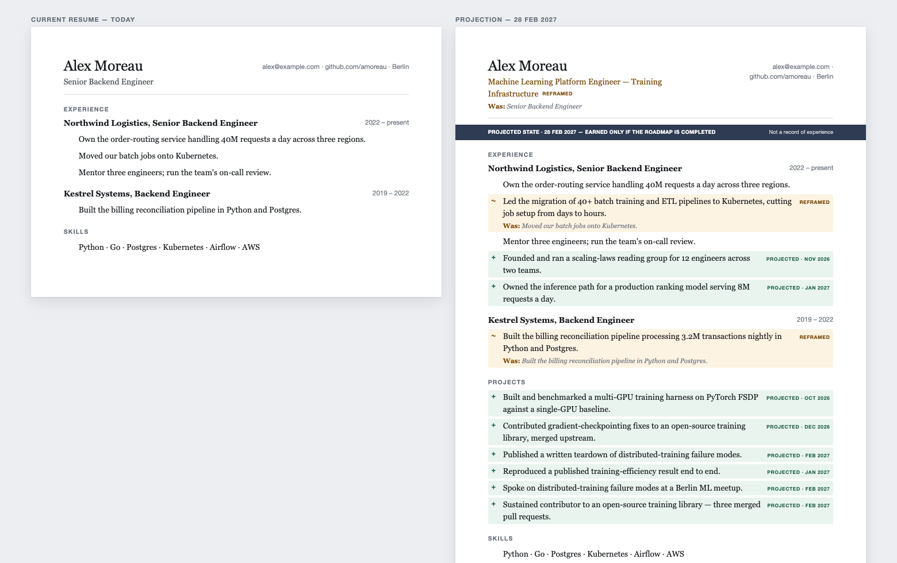
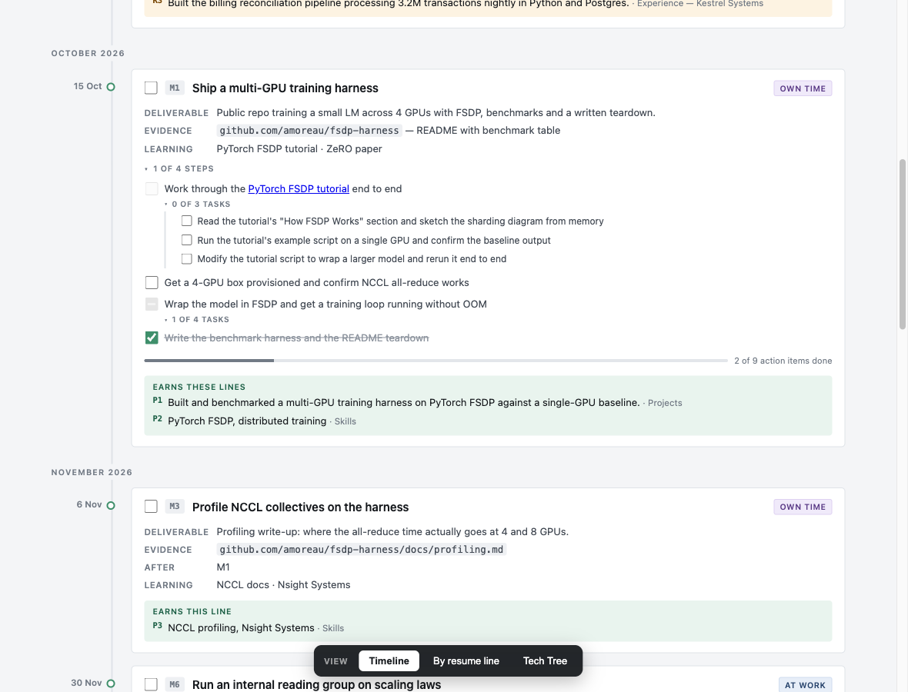
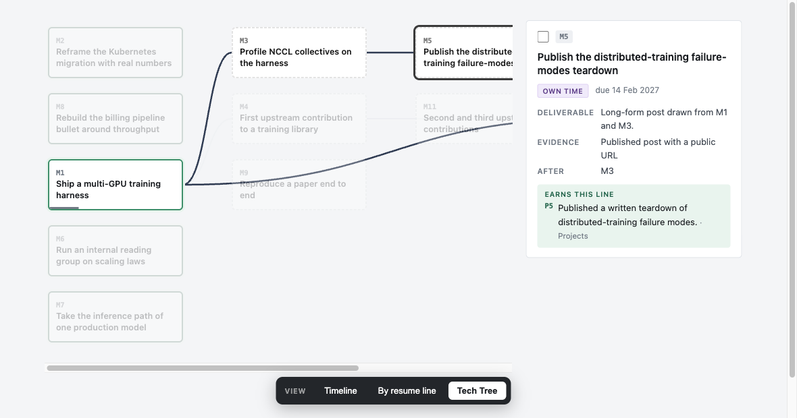
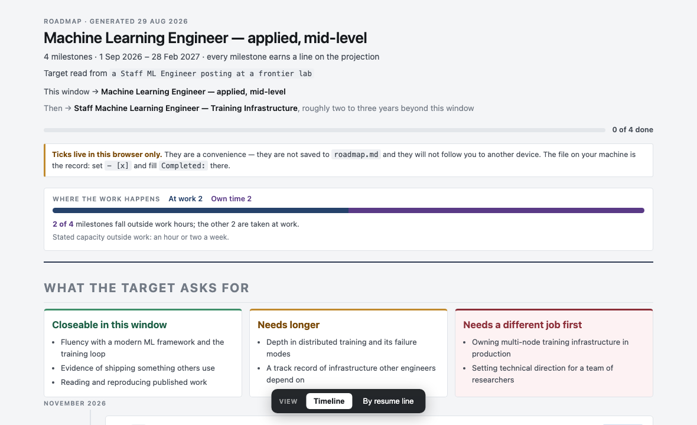

<h1 align="center">your-next-resume</h1>

<p align="center">
  <b>Imagine your resume six months from now — and get the roadmap that earns it.</b><br>
  An agent skill. Runs on your machine. Your resume never leaves it.
</p>

<p align="center">
  <a href="https://github.com/voidforall/your-next-resume/actions/workflows/ci.yml"></a>
  <a href="LICENSE"></a>
  = 18">
  
</p>

**No line appears on the projection unless a milestone earns it.** Every green line traces to a
dated milestone that names the evidence which would prove it — a repo, a merged PR, a design doc
your team reviewed. If nothing earns a line, it's deleted, not softened.

<p align="center">
  
</p>

```bash
npx skills add voidforall/your-next-resume
```

Then ask your agent: *"here's my CV and the job I want — what would my resume look like in six months?"*

## The rule

**No line appears on the projection unless a milestone earns it.**

Every green line traces to a dated milestone that names the evidence which would prove it — a repo, a merged PR, a design doc your team reviewed. If nothing earns a line, the line is deleted, not softened. That is what separates this from a machine that writes you a flattering lie: the projection is a claim, and the roadmap is what makes it payable.

Amber lines are different: those are true *today*, reworded to speak the target's language, with the original kept underneath. Reframing may never add a fact.

## What you get

Seven files in `./your-next-resume/`:

| | |
| --- | --- |
| `projection.pdf` | the stamped future-state resume — **not** submittable, and it says so in the band, on every projected line, and in the PDF metadata |
| `resume-today.pdf` | everything true about you today, retuned for the target — **submittable this afternoon** |
| `roadmap.html` | the plan, offline and self-contained |
| `projection.html` · `resume-today.html` | the same two documents on screen |
| `roadmap.md` · `projection.md` | the source. Yours to edit; re-render any time |

<p align="center">
  
</p>

Each milestone says what to build, by when, what evidence proves it, and which resume line it buys. It is labelled **At work** or **Own time**, and the page shows the split — because a plan that quietly assumes your evenings is a plan for people who have evenings.

A milestone breaks down into **Steps**, and a Step can break down further into granular,
roughly-hour-sized **Tasks** — collapsed by default so the page stays scannable, open the moment
you're ready to work through one. Tick a task and the progress bar above it moves, its Step's
checkbox updates (checked, or a dash if partway through), and the roadmap-wide tally at the top of
the page moves too — three levels, one tick, always in gray or `--accent`, never the green that
means a milestone is actually, Evidence-backed done.

The page ships three views, switchable at the bottom: a dated **Timeline**, the same plan **by
resume line** (which bullet does this milestone buy, and why), and a game-style **Tech Tree** —
milestones laid out by dependency, lit up or dimmed as you click through what a milestone needs and
what it unlocks, dashed and grayed out until every prerequisite is actually done.

<p align="center">
  
</p>

## When the target is out of reach

It will tell you, and plan the first leg instead of promising the whole trip.

<p align="center">
  
</p>

Every requirement in the posting is sorted into *closeable in this window*, *needs longer*, or *needs a different job first* — that last one being the honest reason some jobs are two moves away, not one. No score out of 100; scanners disagree with each other by twenty points on the same file, and a number would only look precise.

## What it won't do

Ask it to take the banner off and it declines:

> I can't take the banner or the `+` marks off — they are the same stamp in three layers, and without them the document reads as a record of work you haven't done yet.
>
> The resume you can send tomorrow already exists: `your-next-resume/resume-today.pdf` — no banner, no marks, no projected bullets, and every line on it is true today.

It won't backdate a milestone, write experience at an employer you haven't worked for, or word projected bullets as things you've already done.

## What it isn't

Not an ATS optimiser — those scores are noise. Not a job board. Not a guarantee: a roadmap is a plan, and plans are wrong. It won't make you a Staff engineer in six months if you aren't close, and it will say so rather than print it.

## Requirements

Node 18+ and Chrome, Chromium or Edge for the PDFs. No API keys, no account, no network — everything runs locally, and nothing is uploaded. Without a browser you still get every document, and instructions to print them yourself.

## How it's built

`skills/your-next-resume/` is the skill. [`CONTEXT.md`](CONTEXT.md) is the vocabulary,
[`docs/adr/`](docs/adr/) is every decision and why it was made — 15 so far, from the projection
contract itself to the Tech Tree view and the nested Task checklist — and [`evals/`](evals/) holds
the cases it was tested against, including a no-skill baseline.

Zero runtime dependencies. The roadmap page is one self-contained HTML file — no build step, no
CDN, opens from `file://` forever.

MIT.
